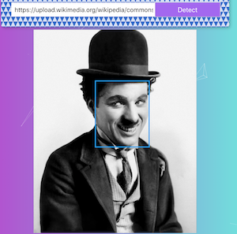

# facerecognitionbrain-api
Backend for facerecognition

node
express.js
nodemon
body-parser
postman.com
filesystem
modules with node
bcrypt
cors
databases
knex.js
database transaction
code review
controllers
security review 
validation
moving clarifai api from front to backend for security reasons 
environmental variables

### facereconitionbrain-api

# Description
Users can insert an image-url and check if a face is in their picture. If a face is detected, it will be surrounded by a blue box.
This project was used as a learning project. 

# Screenshot

# This is the Backend
You can find the Frontend here: LINK

# Learned Concepts
* ## Node
* express.js
* nodemon
* body-parser
* postman.com
* filesystem
* modules with node
* bcrypt
* cors
* relational databases (postgresql)
* knex.js
* database transaction
* API keys to backend for security reasons 
* environmental variables
* Image Recognition API usage (https://www.clarifai.com/)

# Installation
1. Clone this repository
2. Run `npm install`
3. Run `npm start`
4. You must add your own API key in the controllers/image.js to connect to Clarifai API (https://www.clarifai.com/)

# Acknowledgment
This project was done as part of the Udemy Zero To Mastery Course by [Andrei Neagoie](https://github.com/aneagoie)

# Project status
As this project was done for learning purposes only. It is unlikely that further development will take place in the future. 
